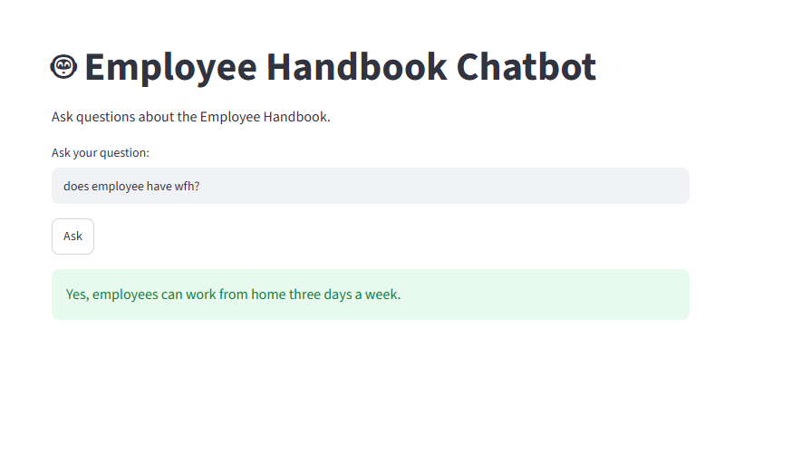

# 📚 Employee Handbook RAG Chatbot

A Production-ready Retrieval-Augmented Generation (RAG) chatbot built using LangChain, ChromaDB, Groq, Hugging Face Embeddings, and Streamlit.

The chatbot answers questions based only on the uploaded Employee Handbook PDF using semantic search and Retrieval-Augmented Generation.

---

## 🚀 Features

- PDF document ingestion
- Automatic text chunking
- Semantic embeddings using Hugging Face
- ChromaDB Vector Database
- Similarity Search
- Retrieval-Augmented Generation (RAG)
- Groq Llama 3.3 70B Integration
- Streamlit Web UI

---

## 🛠️ Tech Stack

- Python
- LangChain
- ChromaDB
- Hugging Face Embeddings
- Groq (Llama 3.3 70B)
- Streamlit

---

## 📂 Project Structure

```
13-rag-chatbot/
│
├── app.py
├── ingest.py
├── rag.py
├── requirements.txt
├── README.md
├── data/
│   └── employee_handbook.pdf
├── chroma_db/
└── .env
```

---

## ⚙️ How it Works

### Step 1

Load the PDF.

↓

### Step 2

Split the PDF into smaller chunks.

↓

### Step 3

Convert each chunk into embeddings using Hugging Face.

↓

### Step 4

Store embeddings inside ChromaDB.

↓

### Step 5

Convert the user's question into an embedding.

↓

### Step 6

Retrieve the most relevant chunks using similarity search.

↓

### Step 7

Send the retrieved context and question to the Groq LLM.

↓

### Step 8

Generate the final answer.

---

## 🏗️ Architecture

```
User Question
      │
      ▼
Retriever
      │
      ▼
ChromaDB
      │
      ▼
Relevant Chunks
      │
      ▼
Prompt
      │
      ▼
Groq LLM
      │
      ▼
Final Answer
```

---

## ▶️ Run the Project

### Install dependencies

```bash
pip install -r requirements.txt
```

### Create Vector Database

```bash
python ingest.py
```

### Run Streamlit

```bash
streamlit run app.py
```

---

## 💬 Sample Questions

- How many paid leaves do employees receive?
- Can employees work from home?
- Who is covered under health insurance?
- Can unused leaves be carried forward?
- What is the travel reimbursement policy?

---

## 📸 Demo

(Add a screenshot of the Streamlit UI here.)

---

## 📖 Learning Outcomes

This project demonstrates:

- Retrieval-Augmented Generation (RAG)
- Embedding Models
- Vector Databases
- Semantic Search
- LangChain Expression Language (LCEL)
- Prompt Engineering
- LLM Integration
- Streamlit Deployment

---

## 👨‍💻 Author

Built as part of my AI Engineering learning journey.