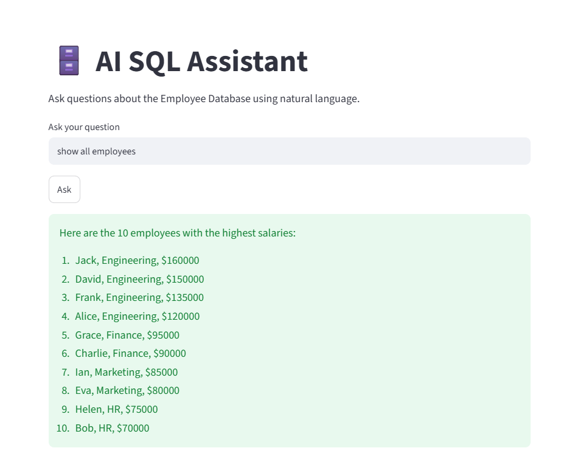

# 🗄️ AI SQL Assistant

An AI-powered SQL Assistant built using **LangChain**, **Groq Llama 3.3**, **SQLite**, and **Streamlit**. This application allows users to interact with a relational database using natural language instead of writing SQL queries manually.

The assistant automatically understands the database schema, generates SQL queries, executes them, and returns the results in plain English.

---

## 🚀 Features

- Natural Language to SQL conversion
- AI-powered SQL query generation
- Automatic database schema understanding
- SQLite database integration
- LangChain SQL Agent
- Groq Llama 3.3 integration
- Streamlit web interface
- Safe SQL execution through LangChain

---

## 🛠️ Tech Stack

- Python
- LangChain
- LangChain SQL Agent
- Groq (Llama 3.3 70B)
- SQLite
- SQLAlchemy
- Streamlit
- Python Dotenv

---

## 📂 Project Structure

```
14-ai-sql-assistant/
│
├── app.py              # Streamlit UI
├── database.py         # Creates and populates SQLite database
├── sql_agent.py        # LangChain SQL Agent
├── employees.db        # SQLite Database
├── requirements.txt
├── README.md
├── .gitignore
└── .env
```

---

## ⚙️ How It Works

### Step 1

Create a SQLite database.

↓

### Step 2

Create the Employees table.

↓

### Step 3

Insert sample employee data.

↓

### Step 4

LangChain connects to the SQLite database.

↓

### Step 5

The SQL Agent reads the database schema.

↓

### Step 6

The LLM converts the user's question into a SQL query.

↓

### Step 7

SQLite executes the generated SQL query.

↓

### Step 8

The SQL Agent converts the SQL result into a natural language response.

---

## 🏗️ Architecture

```

                 User Question
                        │
                        ▼
               LangChain SQL Agent
                        │
                        ▼
               Understand Schema
                        │
                        ▼
              Generate SQL Query
                        │
                        ▼
                SQLite Database
                        │
                        ▼
                 Query Results
                        │
                        ▼
              Natural Language Answer

```

---

## ▶️ Installation

### Clone the repository

```bash
git clone <your-repository-url>
```

---

### Navigate to the project

```bash
cd 14-ai-sql-assistant
```

---

### Install dependencies

```bash
pip install -r requirements.txt
```

---

### Create Environment Variable

Create a `.env` file:

```env
GROQ_API_KEY=your_groq_api_key
```

---

### Create the Database

```bash
python database.py
```

---

### Run the Application

```bash
streamlit run app.py
```

---

## 💬 Sample Questions

- Show all employees.
- Who has the highest salary?
- Which employees work in Bangalore?
- What is the average salary?
- Show employees from HR.
- How many employees are there?
- Average salary by department.
- Which employee has the highest experience?
- List all cities.
- Show employees earning more than ₹100000.

---

## 📸 Demo

Add a screenshot here.

Example:




---

## 📚 Learning Outcomes

This project demonstrates:

- AI Agents
- Tool Calling
- Natural Language to SQL
- SQLite Integration
- LangChain SQL Toolkit
- Database Schema Understanding
- SQL Query Generation
- LLM Integration
- Streamlit Application Development

---

## 🔮 Future Improvements

- Support multiple databases (MySQL, PostgreSQL)
- Database authentication
- SQL query history
- Chat interface
- Query explanation
- Data visualization
- Download query results as CSV
- User authentication

---

## 👨‍💻 Author

Built as part of my AI Engineering learning journey.