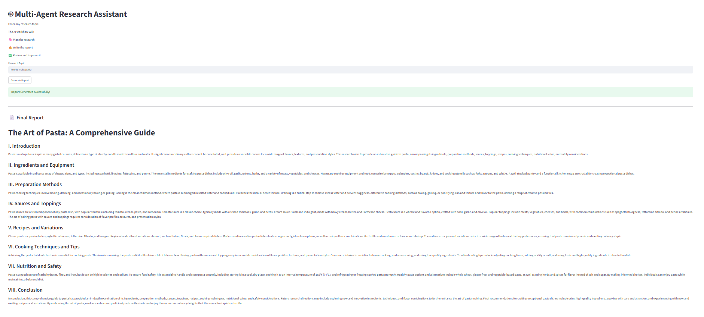

# 🤖 Multi-Agent Research Assistant

A production-ready **Multi-Agent AI Research Assistant** built using **LangGraph**, **LangChain**, **Groq Llama 3.3**, and **Streamlit**.

Instead of relying on a single AI model, this application uses multiple specialized AI agents that collaborate to generate a high-quality research report.

The workflow consists of:

- 🧠 Planner Agent
- ✍️ Writer Agent
- ✅ Reviewer Agent

Each agent performs a dedicated task, making the system modular, scalable, and easy to maintain.

---

# 🚀 Features

- Multi-Agent Architecture
- LangGraph Workflow
- Planner Agent
- Writer Agent
- Reviewer Agent
- Groq Llama 3.3 Integration
- Streamlit Web Interface
- Modular Agent Design
- Research Report Generation

---

# 🛠️ Tech Stack

- Python
- LangChain
- LangGraph
- Groq (Llama 3.3 70B)
- Streamlit
- Python Dotenv

---

# 📂 Project Structure

```
15-multi-agent-research/
│
├── app.py
├── agents.py
├── workflow.py
├── requirements.txt
├── README.md
├── .gitignore
├── .env
└── images/
    └── demo.png
```

---

# ⚙️ How It Works

### Step 1

User enters a research topic.

↓

### Step 2

Planner Agent creates a structured research plan.

↓

### Step 3

Writer Agent converts the plan into a detailed report.

↓

### Step 4

Reviewer Agent improves the report by enhancing grammar, clarity, and readability.

↓

### Step 5

The final polished report is displayed to the user.

---

# 🏗️ Workflow

```
                 User Topic
                      │
                      ▼
              Planner Agent
                      │
                      ▼
              Writer Agent
                      │
                      ▼
             Reviewer Agent
                      │
                      ▼
              Final Report
```

---

# ▶️ Installation

## Clone Repository

```bash
git clone <your-repository-url>
```

---

## Navigate to Project

```bash
cd 15-multi-agent-research
```

---

## Install Dependencies

```bash
pip install -r requirements.txt
```

---

## Create .env File

```env
GROQ_API_KEY=your_groq_api_key
```

---

## Run the Application

```bash
streamlit run app.py
```

---

# 💬 Sample Topics

- Artificial Intelligence
- Agentic AI
- Quantum Computing
- Climate Change
- Blockchain
- Cyber Security
- Data Engineering
- PySpark
- Databricks
- Healthcare AI

---

# 📸 Demo




---

# 📚 Learning Outcomes

This project demonstrates:

- Multi-Agent Systems
- LangGraph
- Workflow Orchestration
- State Management
- Prompt Engineering
- LLM Chaining
- Modular AI Design
- AI Report Generation
- Streamlit Deployment

---

# 🔮 Future Improvements

- Add Internet Search Tool
- Add PDF Report Export
- Parallel Agent Execution
- Research Citations
- Human-in-the-loop Review
- Multi-language Support
- Agent Memory
- Save Previous Reports

---

# 👨‍💻 Author

Built as part of my AI Engineering learning journey.