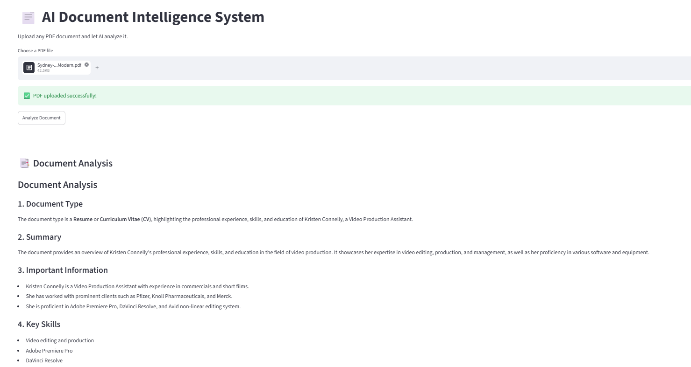
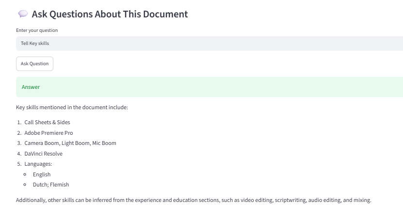

# 📄 AI Document Intelligence System

An AI-powered document analysis application built using **LangChain**, **Groq Llama 3.3**, and **Streamlit**.

The application allows users to upload PDF documents, automatically analyze their contents, generate summaries, extract important information, and ask questions about the uploaded document.

---

## 🚀 Features

- 📄 Upload PDF documents
- 🤖 AI-powered document analysis
- 📝 Automatic document summarization
- 🔍 Extract important information
- 💬 Ask questions about the uploaded document
- ⚡ Fast inference using Groq Llama 3.3
- 🎨 Interactive Streamlit interface

---

## 📚 Supported Documents

- Resume
- Invoice
- Contract
- Medical Report
- Boarding Pass
- Research Paper
- Any text-based PDF

---

## 🛠️ Tech Stack

- Python
- LangChain
- LangChain Community
- LangChain Groq
- Streamlit
- PyPDF
- Python Dotenv

---

## 📂 Project Structure

```
16-document-intelligence/
│
├── app.py
├── extractor.py
├── analyzer.py
├── qa.py
├── prompts.py
├── requirements.txt
├── README.md
├── .gitignore
├── .env
│
├── uploads/
│
└── images/
    └── demo.png
```

---

## ⚙️ How It Works

```
            Upload PDF
                 │
                 ▼
          Extract Text
                 │
                 ▼
          AI Document Analysis
                 │
        ┌────────┴────────┐
        │                 │
        ▼                 ▼
   Summary          Information Extraction
        │
        ▼
 Ask Questions About Document
        │
        ▼
    AI Answers
```

---

## ▶️ Installation

Clone the repository

```bash
git clone <repository-url>
```

Move into the project

```bash
cd 16-document-intelligence
```

Install dependencies

```bash
pip install -r requirements.txt
```

Create a `.env` file

```env
GROQ_API_KEY=your_groq_api_key
```

Run the application

```bash
streamlit run app.py
```

---

## 💬 Example Questions

### Resume

- What are the candidate's skills?
- What technologies does the candidate know?
- How many years of experience does the candidate have?

### Invoice

- What is the invoice number?
- What is the total amount?
- What is the due date?

### Contract

- Who are the parties involved?
- What are the payment terms?
- What is the termination clause?

---

## 📸 Demo

Add your application screenshot inside





---

## 🎯 Learning Outcomes

This project demonstrates:

- PDF Processing
- Prompt Engineering
- LangChain Chains
- LLM Integration
- Information Extraction
- AI Question Answering
- Streamlit Development
- Session State Management

---

## 🔮 Future Improvements

- OCR support for scanned PDFs
- Multi-document analysis
- RAG using vector databases
- Chat history
- Export analysis to PDF
- Document comparison
- Support for DOCX and TXT files

---

## 👨‍💻 Author

Built as part of my AI Engineering learning journey.